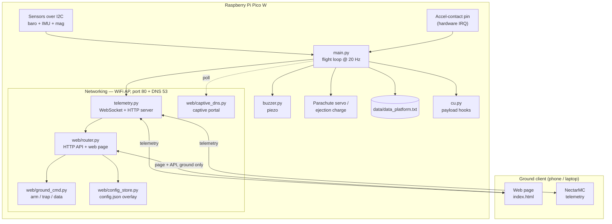
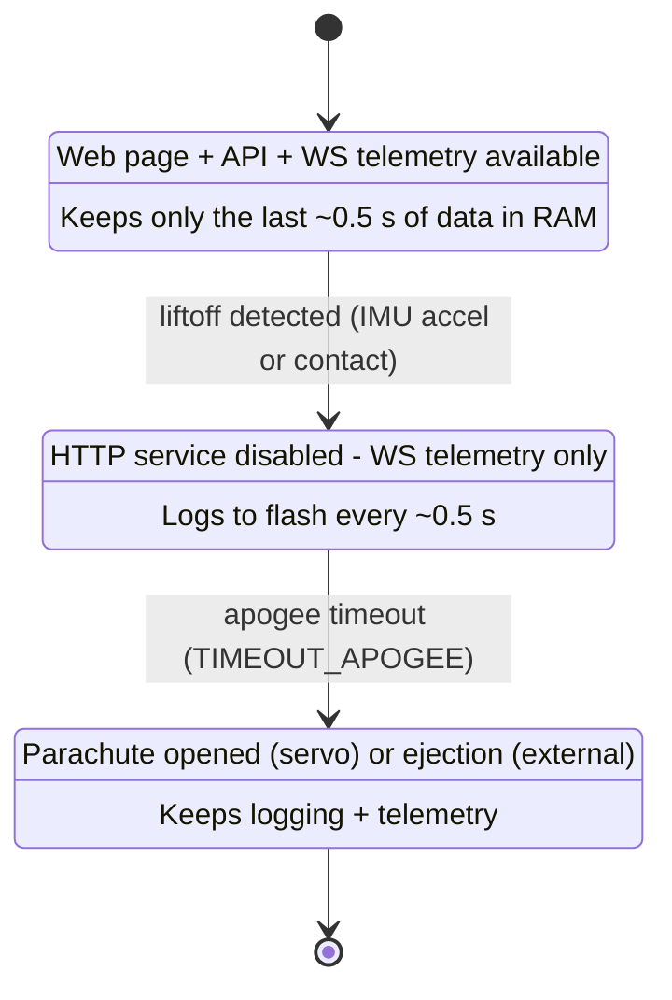
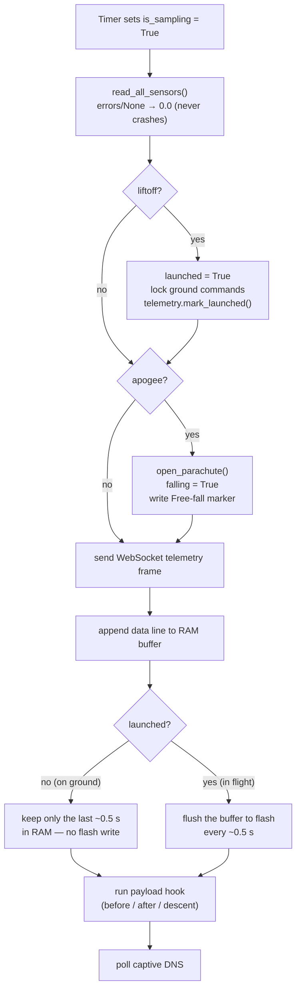
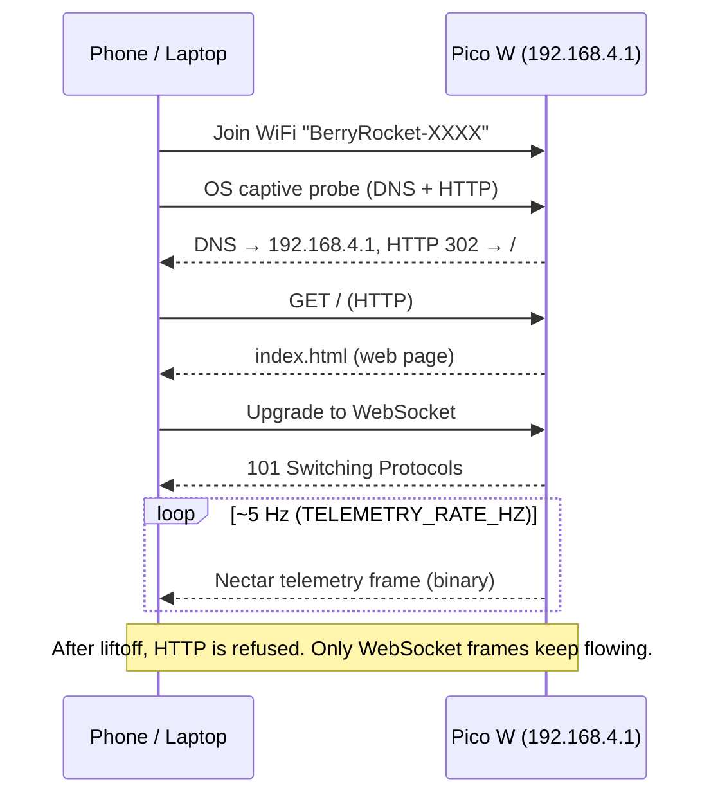
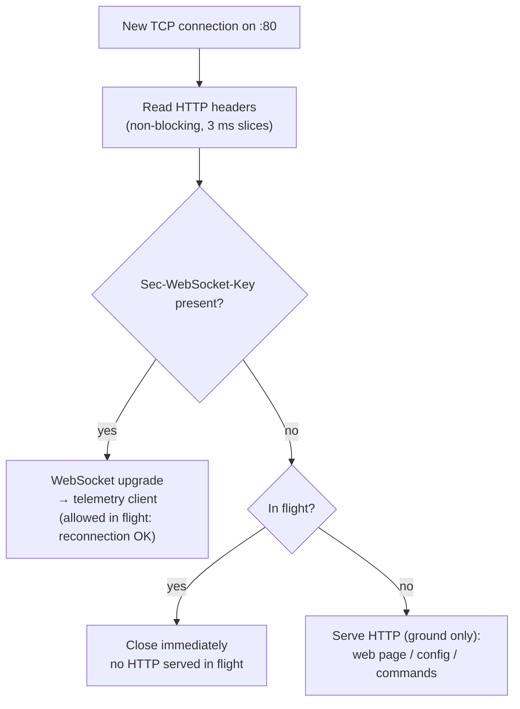
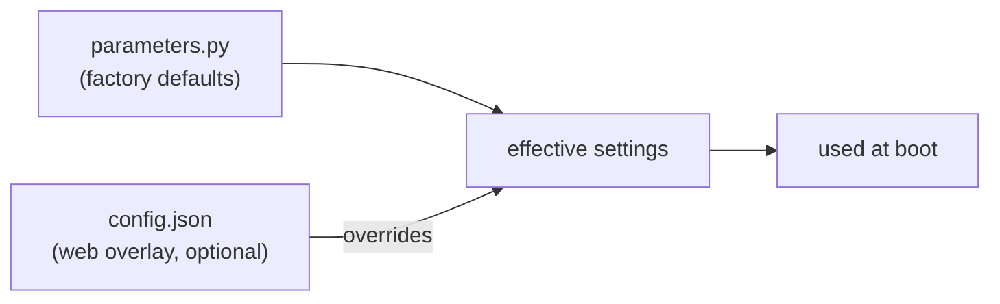
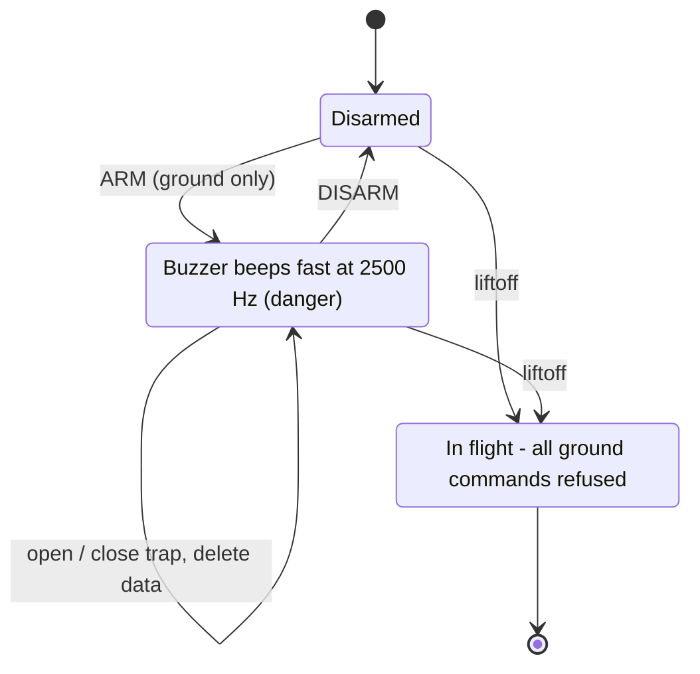

# br-code

MicroPython firmware for BerryRocket avionics boards
([github.com/berryrocket/br-code](https://github.com/berryrocket/br-code))


[](https://berryrocket.com)
[](https://berryrocket.com/wiki/BR_Mini_Avionic)
[](https://berryrocket.com/wiki/BR_Micro_Avionic)

## Overview

This repository contains the on-board firmware for a model-rocket flight
computer running **MicroPython on a Raspberry Pi Pico W**. It is designed to be
**simple enough for students to read and modify**, while still providing a
complete flight stack:

- **Flight sequencing** — liftoff detection, apogee timing, parachute deployment
- **Sensor acquisition** at 20 Hz — pressure, temperature, acceleration, angular
  rate, magnetic field
- **Data logging** to on-board flash (LittleFS), power-loss resilient
- **Live telemetry** over WiFi using **Nectar** frames on a **WebSocket**
- **Embedded web interface** (configuration, live graph, ground commands)
- **Payload hooks** — a dedicated file (`cu.py`) where students add their own code
- **Buzzer feedback** for every flight phase

The board is meant for the BerryRocket *Mini Avionic* / *Micro Avionic* stacks.

## Features at a glance

| Area | What it does |
|---|---|
| Liftoff detection | IMU acceleration threshold **and/or** mechanical accel-contact |
| Apogee detection | Time-based (`TIMEOUT_APOGEE`) after liftoff |
| Recovery | Parachute servo trap **or** ejection charge (external) |
| Logging | `data/data_platform.txt`, file kept open + `flush()` per batch |
| Telemetry | WiFi Access Point + WebSocket, Nectar binary frames (default 5 Hz) |
| Web UI | Served on the same port 80 (HTTP), auto-opens via captive portal |
| Safety | Ground commands require explicit **arm**; locked once in flight |
| Robustness | Sensor/payload errors never crash the flight loop |

---

## System architecture



`main.py` owns the real-time loop and the hardware. Everything network-related
lives behind `telemetry.py`, which is **polled from the loop** and is designed to
**never block** it.

---

## Repository structure

```
.
├── LICENSE
├── README.md                ← this file
├── main.py                  flight loop + sequencing (entry point)
├── parameters.py            factory configuration (overridable by config.json)
├── buzzer.py                piezo buzzer control
├── cu.py                    payload hooks — where students add their code
├── telemetry.py             WiFi AP + WebSocket/HTTP server (Nectar frames)
├── lib/                     sensor drivers + telemetry frame encoder
│   ├── lps22hb.py           barometer (pressure + temperature)
│   ├── icm20948.py          9-DOF IMU            (SENSOR_BOARD = 10DOF_V1)
│   ├── mpu9250.py           9-DOF IMU            (SENSOR_BOARD = 10DOF_V2.1)
│   ├── mpu6500.py           IMU core used by MPU9250
│   ├── ak8963.py            magnetometer used by MPU9250
│   ├── lsm6dsx.py           6-DOF IMU            (SENSOR_BOARD = BR_MINI_SENSOR)
│   ├── xis2mdx.py           magnetometer         (SENSOR_BOARD = BR_MINI_SENSOR)
│   ├── imu.py               shared IMU helpers
│   └── nectar.py            NectarMC telemetry frame encoder
├── web/                     ground interface, served over WiFi
│   ├── router.py            HTTP API + serves the web page
│   ├── ground_cmd.py        arm / parachute / data commands (safety model)
│   ├── config_store.py      config.json overlay (load / save / reset)
│   ├── captive_dns.py       captive portal (auto-opens the page)
│   └── www/
│       └── index.html       single-page web UI (config + telemetry + commands)
└── data/                    flight logs (created at runtime)
```

| File | Purpose |
|---|---|
| `main.py` | Hardware setup, flight state, 20 Hz acquisition loop, sequencing |
| `parameters.py` | All tunable constants (factory defaults) |
| `cu.py` | Four payload functions called at boot / before / after liftoff / descent |
| `buzzer.py` | Periodic beeps (`set_buzzer`) + optional startup melody |
| `telemetry.py` | WiFi AP, WebSocket server, Nectar frame emission, HTTP dispatch |
| `web/router.py` | HTTP routes: page, `/api/config`, `/api/cmd/*`, `/api/data` |
| `web/ground_cmd.py` | Arm/disarm, open/close trap, delete data — with safety locks |
| `web/config_store.py` | Reads/writes `config.json` overlay on the flash |
| `web/captive_dns.py` | Lies to every DNS query so the OS opens the page on connect |
| `lib/nectar.py` | Builds Nectar telemetry frames (magic + id + payload + CRC16) |

---

## Flight sequence

The flight is a small state machine driven by the sensors and a timer.



### What happens on each acquisition tick (20 Hz)



> **Safety by design:** the parachute is opened **before** the file write in the
> same tick, and apogee is driven by the **clock**, not by the sensors. So even
> if a sensor read or a payload hook fails, the recovery still triggers. Sensor
> reads and payload hooks are wrapped so they can never crash the loop.

---

## WiFi, the web page and live telemetry

When `TELEMETRY_ENABLE` is on, the board becomes a **WiFi Access Point** named
`BerryRocket-XXXX` (open network by default) at **`192.168.4.1`**.

A **single TCP server on port 80** serves **two different things on the same
port**, told apart by the HTTP headers:

- **HTTP** → the web page (`index.html`) and the JSON API (`/api/...`)
- **WebSocket** → the live telemetry stream (Nectar frames)

A tiny **captive DNS** on port 53 answers *every* domain with `192.168.4.1`. This
triggers the "Sign in to network" pop-up on phones/laptops, so the web page
**opens automatically** when you join the WiFi.

### Connecting and going live



### Ground vs flight: how a connection is handled

The flight loop must **never** be blocked by the network. Reading an HTTP request
body or sending the ~10 KB page *can* block, but those only ever happen **on the
ground** (you load the page and send commands before launch). Live telemetry is a
**non-blocking** WebSocket push.

So once liftoff is detected, the server **stops serving HTTP entirely** and only
keeps the WebSocket telemetry alive:



This keeps the in-flight code path tiny and guaranteed non-blocking, while still
letting a telemetry client **reconnect** mid-flight if the link drops.

### Nectar telemetry frame

Each WebSocket message is a binary [NectarMC](https://github.com/mlavardin/NectarMC)
frame: `MAGIC(0xEB) | mission id (2B) | payload size (1B) | payload | CRC16 (2B)`.

The payload is packed little-endian as `<I 13f B` (57 bytes total):

| Field | Type | Notes |
|---|---|---|
| `time_ms` | uint32 | milliseconds since boot |
| pressure, temp | 2 × float32 | barometer |
| ax, ay, az | 3 × float32 | acceleration [g] |
| gx, gy, gz | 3 × float32 | angular rate [dps] |
| mx, my, mz | 3 × float32 | magnetic field [gauss] |
| temp_imu, temp_mag | 2 × float32 | sensor temperatures |
| `flags` | uint8 | status bits (below) |

**Status flags (1 byte):**

| Bit | Meaning |
|---|---|
| 0 | `launched` (liftoff detected) |
| 1 | `falling` (apogee passed / parachute) |
| 2 | accel-contact triggered |
| 3 | low free space on flash |
| 4 | sample overrun (loop fell behind) |

---

## Data logging

Flight data is written to **`data/data_platform.txt`**. The file is **opened once
at boot and kept open**.

- **Before liftoff**, samples are kept in a **rolling ~0.5 s RAM buffer** — nothing
  is written to flash yet. This preserves a short pre-launch context without wearing
  the flash on the pad.
- **At liftoff**, the pre-launch buffer is flushed, a `# Lift-off: <t>s` marker is
  inserted, and from then on each batch (~0.5 s) is written and `flush()`-ed to flash.
- LittleFS is **power-loss resilient**: a sudden power cut loses at most the last
  un-flushed batch (~0.5 s), **never the whole file**.
- The header block records software version, rocket type, detection mode and
  acquisition rate. A `# Free-fall: <t>s` marker is added at apogee.

Line format (space-separated):

```
time[s] pressure[mBar] temp[°C] ax ay az[g] gx gy gz[dps] mx my mz[gauss]
```

---

## Configuration

There are two layers of configuration:

1. **`parameters.py`** — the **factory defaults** (never overwritten).
2. **`config.json`** — an **overlay** on the flash. If present, its keys override
   the matching constants at boot. It is written by the web page
   (`POST /api/config`) and can be cleared from the page (*Reset*) or by deleting
   the file in Thonny.



> Changing settings from the web page requires a **reboot** to take effect.

Key parameters (see `parameters.py` for the full list):

| Parameter | Meaning |
|---|---|
| `MOTHER_BOARD` | `BR_MINI_AVIONIC` or `BR_MICRO_AVIONIC` |
| `SENSOR_BOARD` | `NONE`, `10DOF_V1`, `10DOF_V2.1`, `BR_MINI_SENSOR` |
| `EJECTION_CHARGE` | `True` = ejection charge (no servo trap) |
| `LIFTOFF_DET_IMU` / `LIFTOFF_DET_CONTACT` | enable each liftoff detector |
| `LIFTOFF_IMU_THRESHOLD` | acceleration threshold [g] |
| `TIMEOUT_APOGEE` | delay liftoff → free-fall [ms] |
| `SERVO_OPEN` / `SERVO_CLOSE` | servo pulse widths [µs] |
| `FREQ_ACQ` | acquisition rate [Hz] (default 20) |
| `TELEMETRY_ENABLE` / `TELEMETRY_RATE_HZ` | telemetry on/off and rate |

---

## Ground commands & safety

The web page can open/close the parachute trap on the ground, but only behind an
explicit **arm** step:



- Commands are accepted **only while armed**, and arming is **only possible on the
  ground**. Liftoff locks everything.
- While armed, the buzzer emits a distinctive fast high tone so bystanders know the
  trap may move.
- "Delete data" truncates and re-initialises the log file (refused in flight).

---

## Payload hooks (`cu.py`)

`cu.py` is where students add their own experiment code. Four functions are called
automatically:

| Function | When |
|---|---|
| `payload_on_boot(baro, imu)` | once, at power-up |
| `payload_before_liftoff(time_s, baro, imu)` | ~20×/s, on the ground |
| `payload_after_liftoff(time_s, baro, imu)` | ~20×/s, during flight |
| `payload_during_descent(time_s, baro, imu)` | ~20×/s, under parachute |

If your code raises an error, it is caught so the **flight loop keeps running**
(the error is printed only in `DEBUG` mode).

---

## Getting started

### Prerequisites

- A BerryRocket board with a **Raspberry Pi Pico W** (the *W* is required for WiFi
  telemetry; non-W boards run fine but skip telemetry).
- MicroPython firmware for the Pico W.
- [Thonny](https://thonny.org) (recommended for beginners) or any tool to copy
  files to the board.

### Install

1. Flash the MicroPython `.uf2` onto the Pico W.
2. Copy **all** files to the board, keeping the folders: `main.py`,
   `parameters.py`, `buzzer.py`, `cu.py`, `telemetry.py`, and the `lib/` and `web/`
   folders.
3. Edit `parameters.py` to match your board and sensor (or do it later from the
   web page).
4. Reset / power-cycle the board.

### Fly

1. Power on — a startup beep plays, the parachute trap cycles, then a pre-launch
   tone holds.
2. (Optional) Join the `BerryRocket-XXXX` WiFi to configure, watch live telemetry,
   and arm the trap.
3. Launch. Liftoff is detected, data is logged to flash, and telemetry streams to
   any connected client. At apogee the parachute is deployed.
4. Recover the rocket and download `data/data_platform.txt` from the web page or
   over USB.

---

## To go further

- Add a new sensor driver under `lib/` and a branch in `setup_sensors()`.
- Add a payload experiment in `cu.py` (and log to your own file).
- Tune detection thresholds and the apogee timeout in `parameters.py`.
- Extend the web UI in `web/www/index.html`.

## License

This project is licensed under **CC BY-NC-SA** (see `LICENSE`).

[](https://creativecommons.org/licenses/by-nc-sa/4.0/)

## References & resources

[](https://berryrocket.com)
[](https://berryrocket.com/wiki/BR_Mini_Avionic)
[](https://berryrocket.com/wiki/BR_Micro_Avionic)
[](https://github.com/mlavardin/NectarMC)
